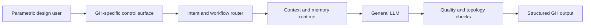

# 架构白皮书（公开版）
# Public Architecture Whitepaper

**Project**: GH Helper（小壁蜂 OsmiaAI）
**Version**: 0.3.8-beta
**Live demo**: https://topogenesis.top/intro/ghhelper

---

## Abstract

GH Helper is a Grasshopper-focused AI assistant built around a lightweight orchestration architecture. It does not publish or train a standalone model. Instead, it combines prompt-level routing, a domain knowledge layer, context management, multi-agent review and structured rendering to make general LLM output more useful in GH workflows.

The public whitepaper focuses on design logic and release-safe architecture. It removes generic Transformer explanations, basic software-pattern tutorials and private implementation details.

---

## 1. Problem

General AI chat works poorly in many Grasshopper tasks because GH answers require exact node names, data tree reasoning, plugin awareness, topology sequencing and sometimes embedded code. A fluent answer can still be unusable if it invents a component, misses a graft/flatten boundary or gives code that does not match the GH script environment.

GH Helper addresses this by adding a product layer that asks three questions before answering:

- What kind of GH task is this?
- Which specialist knowledge or agent roles should inspect it?
- What structured artifact should the user receive: explanation, code, wiring or a review?

---

## 2. Design Thesis

The system treats the LLM as a reasoning engine behind a GH-specific control surface.

This is why the project can remain lightweight: the specialized value is concentrated in routing, prompts, knowledge selection, runtime control and rendering rather than in model training.

---

## 3. Architecture Evolution

| Stage | Limitation | 0.3.8-beta response |
| --- | --- | --- |
| Single chat prompt | Too dependent on one long prompt | Runtime builds request-specific context |
| Generic answer format | Code, topology and text are mixed together | Code and wiring panels render structured blocks |
| Manual expert choice | Users must know what to ask for | Router recommends workflow and agents |
| Long history forwarding | Context becomes noisy and expensive | Context window keeps primers/recent turns and compresses the middle |
| Direct provider access | Browser-side key exposure risk | Server proxy keeps secrets private |

---

## 4. Core Mechanisms

### Intent routing

The router asks the model for a structured decision about complexity, workflow type, search/KB need, code need and recommended agents. If the model does not return valid JSON, the router falls back to rule-based classification.

### Workflow execution

The workflow engine supports six public workflow types:

- simple answer
- ReAct-style retrieval loop
- multi-agent swarm
- research synthesis
- code generation
- deep methodology review

### Multi-agent swarm

The lead agent produces a plan and decomposes tasks. Specialist agents then inspect methodology, plugins, scripts, native nodes, data tree structure, fabrication and research aspects. A critic reviews the result before synthesis.

### Runtime context

The runtime keeps stable primers, recent turns, compressed historical context, memory and artifacts. This helps preserve important GH decisions without flooding every request with all previous messages.

### Structured outputs

The final answer can include normal text, code blocks and graph-like wiring data. Dedicated renderers convert those into inspectable panels.

---

## 5. Why This Matters For GH

| GH difficulty | System response |
| --- | --- |
| Component hallucination | Node-focused role and quality guard |
| Data Tree confusion | Dedicated DataTree role |
| Plugin overuse | Plugin role checks native fallback and dependency risk |
| Script environment mismatch | Script role focuses on C#/Python embedding constraints |
| Buildability | Fabrication role reviews tolerance and rationalization |
| Long design conversations | Context compression and memory |
| Hard-to-read answers | Code and wiring renderers |

---

## 6. Release-Safe Knowledge Strategy

The knowledge base is a private asset. Public docs may describe its categories, such as native components, plugin notes and workflow collections, but should not copy the JSON files or private indexing details.

Safe public statement:

> GH Helper retrieves small, targeted GH knowledge fragments when the router decides retrieval is useful.

Unsafe public statement:

> Publishing the full private KB JSON, internal prompts or runtime task content.

---

## 7. Security Position

The architecture keeps sensitive operations server-side:

- API keys are loaded by the server, not the browser.
- Chat calls go through a PHP proxy.
- Async task IDs are generated server-side.
- Auth tokens are random server-stored values with expiry.
- Databases and task files are private deployment artifacts.

---

## 8. Public Repository Purpose

This repository preserves:

- sanitized architecture documentation
- version history and release boundary
- technical diagrams
- abstract code skeletons

It does not preserve:

- the full product source tree
- private deployment assets
- keys, databases, user data or runtime caches
- knowledge-base JSON contents

For the detailed module map, see [TECHNICAL-ARCHITECTURE.md](./TECHNICAL-ARCHITECTURE.md).
