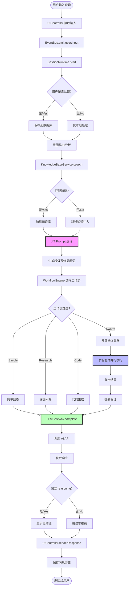
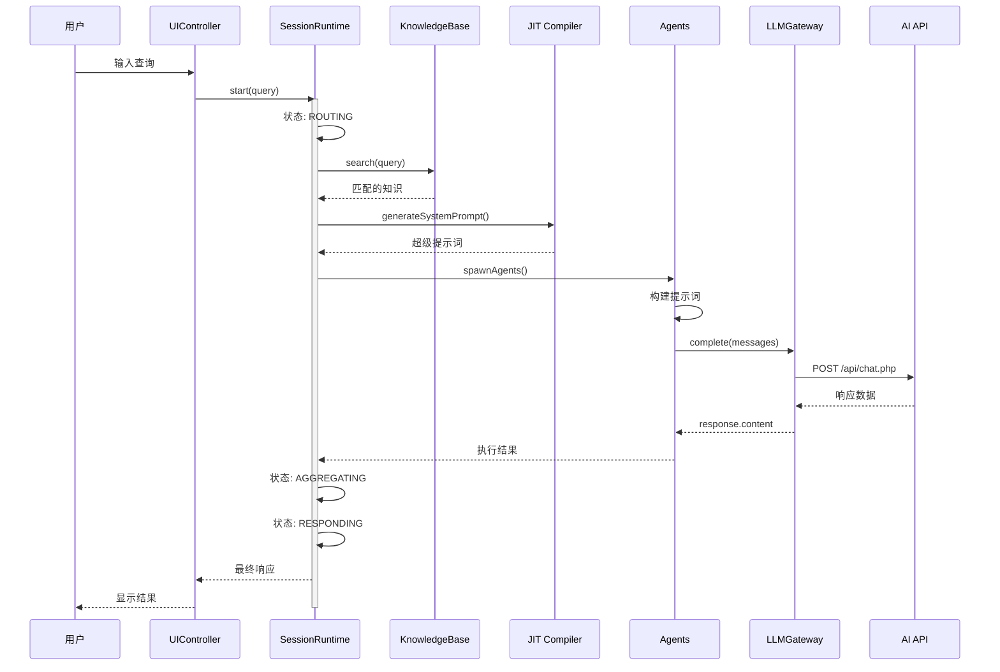
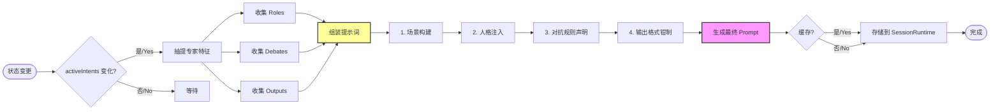
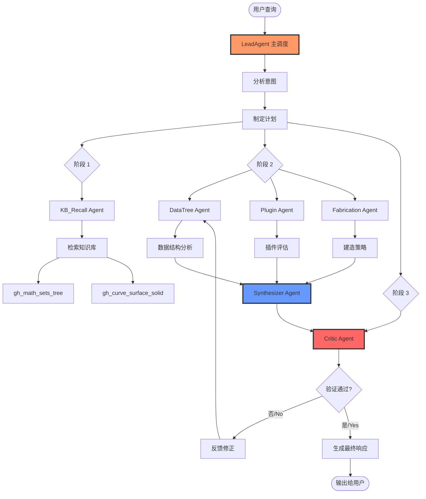
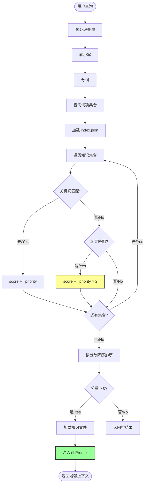
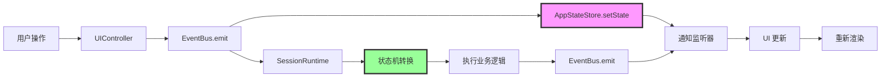
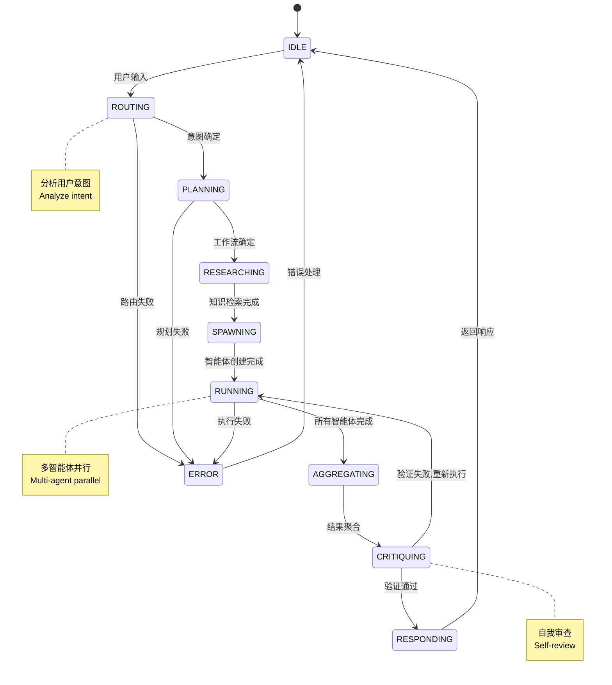
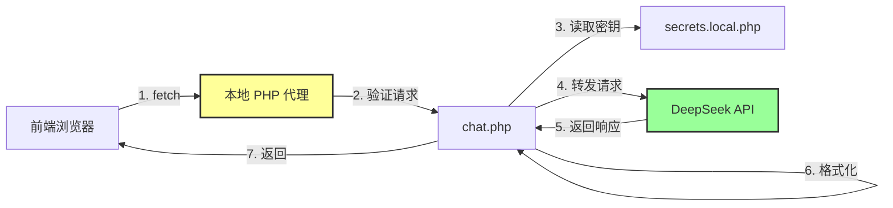
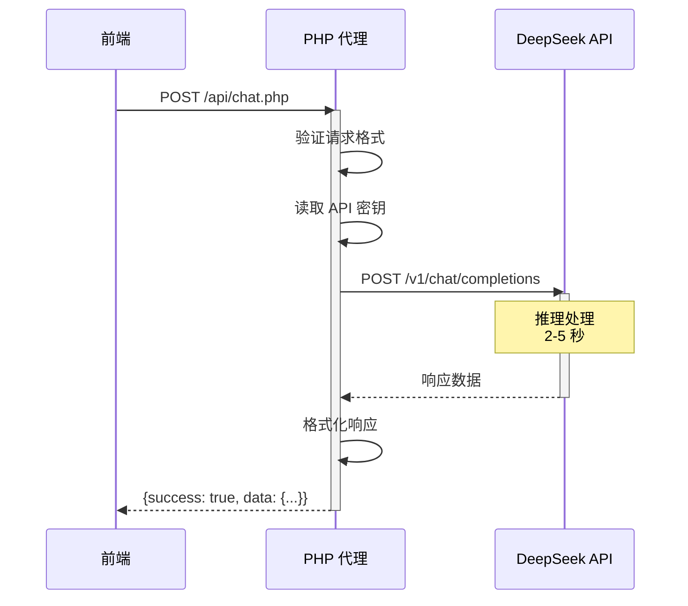
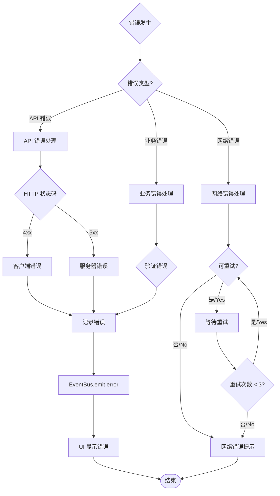

# 数据流图 / Data Flow Diagram

**项目名称 / Project Name**: GH Helper（小壁蜂OsmiaAI）  
**版本 / Version**: v0.3.6-beta  
**在线体验 / Live Demo**: https://topogenesis.top/intro/ghhelper  
**文档类型 / Document Type**: 架构流程图 / Architecture Flow Diagrams

---

## 📋 概览 / Overview

**中文**: 本文档通过 Mermaid 图表详细展示 GH Helper（小壁蜂OsmiaAI） 系统中的关键数据流，包括用户输入到响应的完整流程、JIT 编译流程、多智能体协作流程和知识库检索流程。

**English**: This document uses Mermaid diagrams to detail key data flows in the GH Helper (OsmiaAI) system, including the complete flow from user input to response, JIT compilation flow, multi-agent collaboration flow, and knowledge base retrieval flow.

---

## 1. 用户输入到响应的完整数据流
## 1. Complete Data Flow from User Input to Response

### 1.1 主流程图 / Main Flowchart



### 1.2 时序图 / Sequence Diagram



---

## 2. JIT 编译流程详解
## 2. JIT Compilation Flow Details

### 2.1 编译流程图 / Compilation Flowchart



### 2.2 编译结果示例 / Compilation Result Example

**输入 / Input**:
```javascript
activeIntents = ['datatree', 'plugins', 'fabrication']
```

**输出 / Output**:
```
你是由 cf 开发的 Grasshopper 参数化设计专家助手。
当前激活的专家团队阵容：
- **数据拓扑架构师 (Data Topology Architect)**
- **算法生态专家 (Ecosystem Algorithm Specialist)**
- **建造理化专家 (Fabrication Rationalization Expert)**

【强制交叉研讨与防幻觉机制】
- 【关于专家职能】：死磕 Grasshopper 的灵魂：数据树...
- 【关于专家职能】：评估是否引入第三方算法库...
- 【关于专家职能】：评估几何降阶策略...

【强制输出结构约束】
1. 需求技术锚点解析
<<<SPLIT>>>
输入端数据结构深度剖析
<<<SPLIT>>>
核心树形操作介入节点
<<<SPLIT>>>
最优生态插件架构方案
<<<SPLIT>>>
原生降级替代思路
<<<SPLIT>>>
建造理化策略深度评估
```

---

## 3. 多智能体协作流程
## 3. Multi-Agent Collaboration Flow

### 3.1 协作架构图 / Collaboration Architecture



### 3.2 智能体状态转换 / Agent State Transition

```mermaid
stateDiagram-v2
    [*] --> IDLE
    
    IDLE --> THINKING: 接收任务
    THINKING --> ACTING: 开始执行
    THINKING --> ERROR: 构建失败
    
    ACTING --> WAITING: 依赖其他智能体
    ACTING --> COMPLETED: 执行成功
    ACTING --> ERROR: 执行失败
    
    WAITING --> ACTING: 依赖完成
    
    COMPLETED --> IDLE: 重置
    ERROR --> IDLE: 重试/重置
    
    note right of THINKING
        构建提示词
        Build prompt
    end note
    
    note right of ACTING
        调用 LLM API
        Call LLM API
    end note
    
    note right of CRITIC
        验证结果
        Validate results
    end note
```

---

## 4. 知识库检索流程
## 4. Knowledge Base Retrieval Flow

### 4.1 检索流程图 / Retrieval Flowchart



### 4.2 检索算法伪代码 / Retrieval Algorithm Pseudocode

```javascript
/**
 * Knowledge Base Retrieval Algorithm
 * 知识库检索算法
 */
function retrieveKnowledge(userQuery, knowledgeIndex) {
  // 1. 预处理 / Preprocess
  const queryTerms = userQuery.toLowerCase().split(/\s+/);
  
  // 2. 初始化结果 / Initialize results
  const results = [];
  
  // 3. 遍历所有知识集合 / Iterate all collections
  for (const collection of knowledgeIndex.collections) {
    let score = 0;
    
    // 3.1 关键词匹配 / Keyword matching
    for (const keyword of collection.keywords) {
      if (queryTerms.some(term => keyword.includes(term))) {
        score += collection.priority;
      }
    }
    
    // 3.2 场景匹配（权重×2）/ Scenario matching (weight ×2)
    for (const scenario of collection.scenarios) {
      if (userQuery.toLowerCase().includes(scenario.toLowerCase())) {
        score += collection.priority * 2;
      }
    }
    
    // 3.3 收集结果 / Collect results
    if (score > 0) {
      results.push({
        collection: collection,
        score: score,
        file: collection.file
      });
    }
  }
  
  // 4. 排序 / Sort
  results.sort((a, b) => b.score - a.score);
  
  // 5. 加载前 N 个知识文件 / Load top N knowledge files
  const topResults = results.slice(0, 3);
  const knowledge = await Promise.all(
    topResults.map(r => loadKnowledgeFile(r.file))
  );
  
  // 6. 返回 / Return
  return {
    results: topResults,
    knowledge: knowledge
  };
}
```

---

## 5. 状态管理流程
## 5. State Management Flow

### 5.1 全局状态流转 / Global State Flow



### 5.2 会话状态机 / Session State Machine



---

## 6. API 请求流程
## 6. API Request Flow

### 6.1 请求链路 / Request Chain



### 6.2 请求处理时序 / Request Processing Sequence



---

## 7. 错误处理流程
## 7. Error Handling Flow



---

**最后更新 / Last Updated**: 2026-04-10
