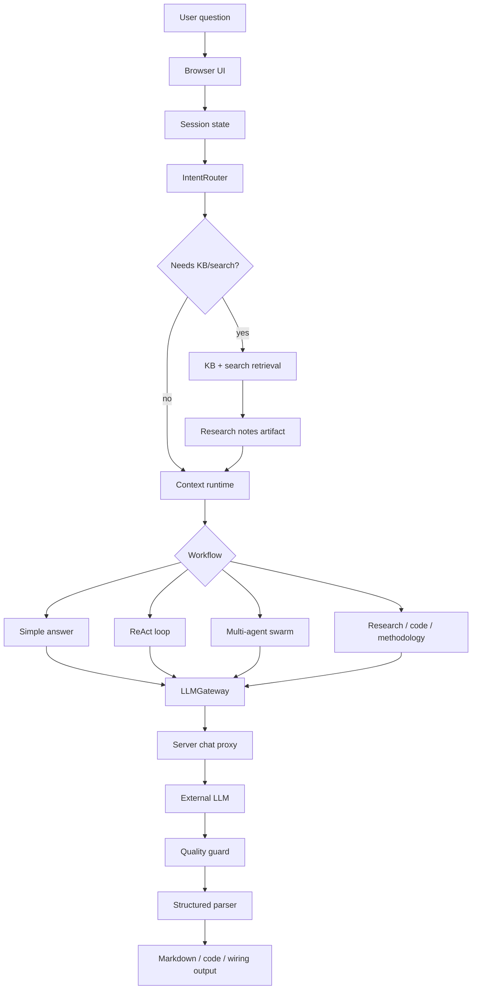
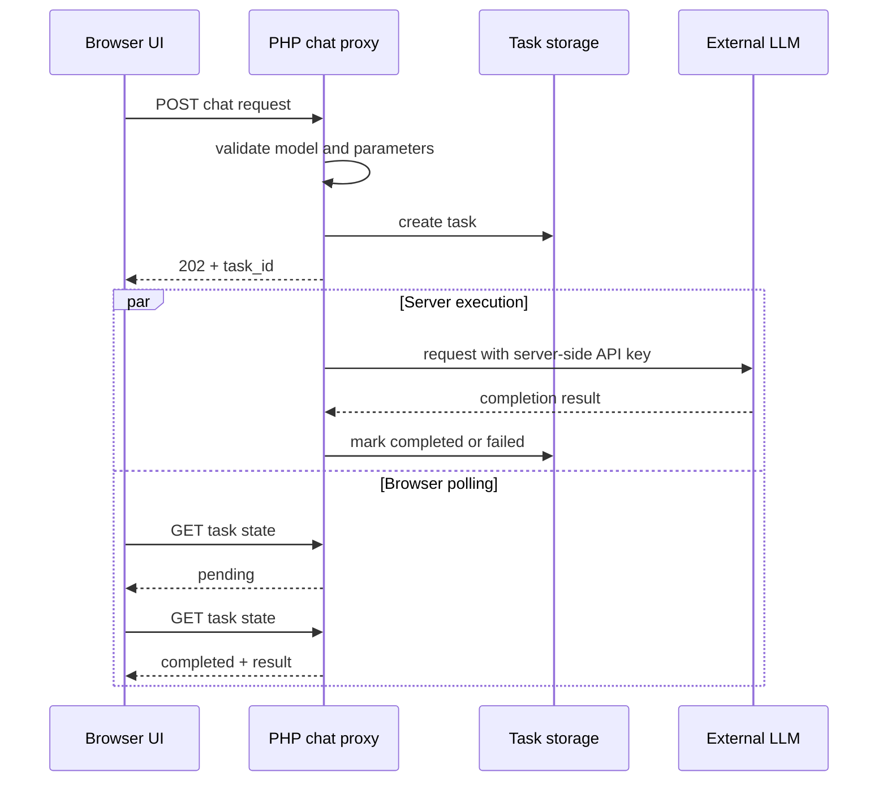
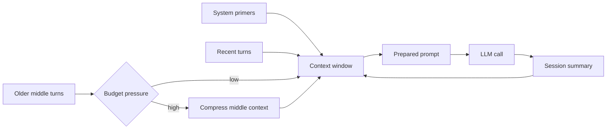
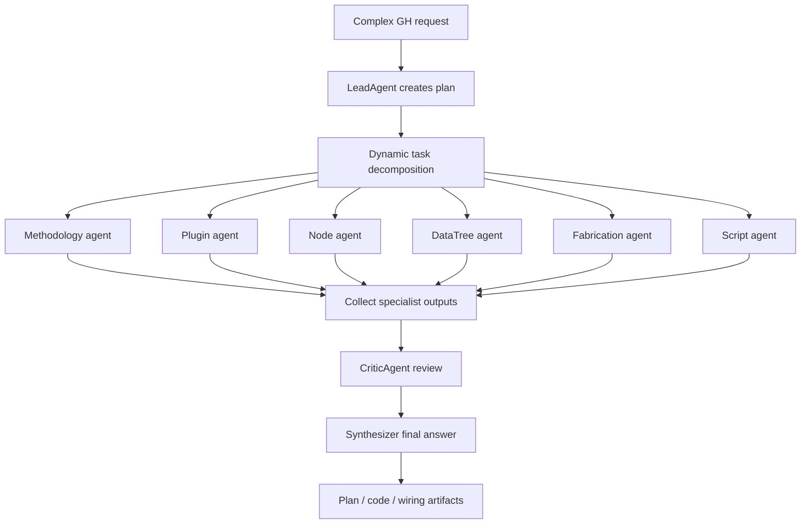
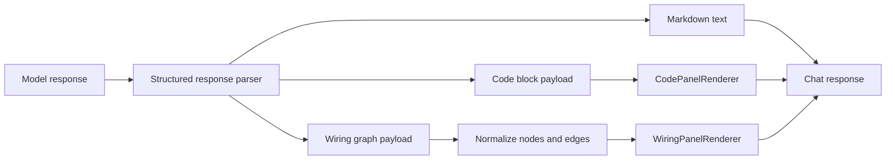
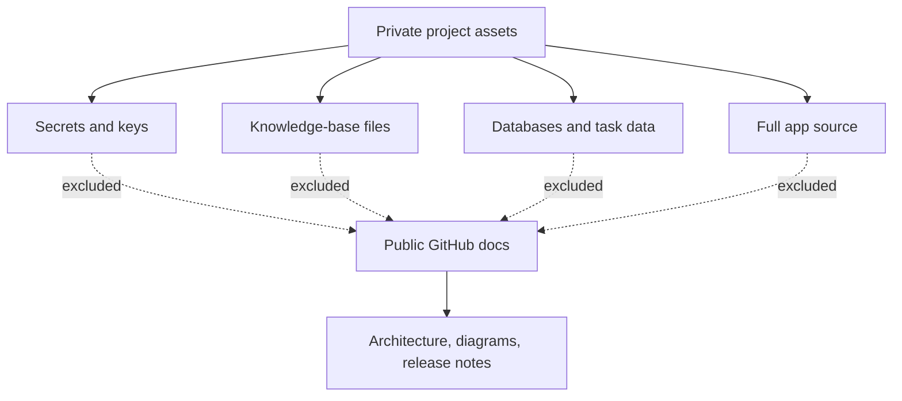

# Data Flow

**Project**: GH Helper（小壁蜂 OsmiaAI）
**Version**: 0.3.8-beta
**Scope**: public sanitized diagrams

This document focuses on project-specific data flows. It intentionally avoids generic diagrams for event buses, stores or basic MVC layers.

---

## 1. Request To Response

---

## 2. Async Task Flow

Security consequence: browser traffic never contains the provider API key.

---

## 3. Context Compression Flow

The current implementation keeps stable primers and recent turns while compressing older middle content once context pressure crosses an internal threshold.

---

## 4. Swarm Workflow Flow

The actual agents selected depend on router analysis and active GH task intent. The public repo documents role categories, not internal prompts.

---

## 5. Structured Rendering Flow

GH answers frequently need code and topology. Rendering them as structured panels makes the response easier to inspect than a single long text block.

---

## 6. Public Release Data Boundary

Any update to this repository should pass a sensitive-content scan before pushing.
