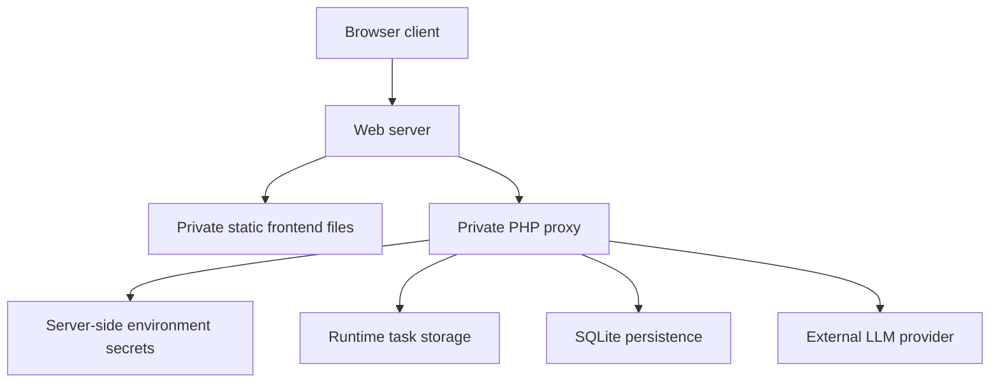

# Deployment Notes

**Project**: GH Helper（小壁蜂 OsmiaAI）
**Version**: 0.3.8-beta
**Scope**: sanitized deployment description

This public repository is not a deployable package. The complete production source tree, knowledge base, database, task cache and secret configuration remain private.

---

## 1. Deployment Shape

The public repository documents this shape but does not include the private files required to run it.

---

## 2. Server-Side Secrets

Provider keys must be set outside the public repository. The deployment should prefer environment variables and keep any local secret fallback file untracked.

Public docs may name the type of secret, for example `GH_DEEPSEEK_API_KEY`, but must not show an assignment or real value.

Public docs must not include real values.

---

## 3. Runtime Storage

The private deployment uses server-side storage for:

- async chat task state
- conversation metadata
- auth tokens
- user account data
- transient logs or cache files

These files are deployment artifacts and should never be committed.

---

## 4. Minimum Deployment Requirements

The private app shape expects:

- HTTPS-capable web hosting
- PHP runtime for proxy endpoints
- SQLite support for lightweight persistence
- writable private runtime directory for task state
- environment variable support for provider keys
- static file hosting for the private frontend bundle

The exact source tree and server configuration are private and are not reproduced here.

---

## 5. Public Release Checklist

Before pushing deployment-related documentation:

- remove real server paths unless they are already public demo URLs
- remove API keys, GitHub tokens, auth tokens and cookies
- remove database files and schema dumps containing user data
- remove private knowledge-base files
- avoid publishing complete private file trees
- describe architecture through layers and responsibilities

---

## 6. Relationship To This Repository

| Repository content | Deployable? | Notes |
| --- | --- | --- |
| Markdown docs | No | Technical archive only |
| `src/` skeleton | No | Abstract architecture reference |
| Release policy | No | Publishing rules |
| Private production source | Not included | Must stay outside public repo |
| Knowledge-base JSON | Not included | Must stay private |
| Secret config | Not included | Must stay private |
