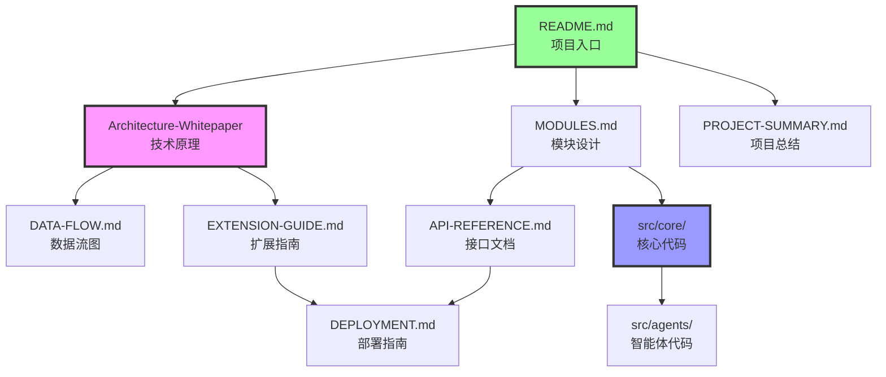

# GH Helper（小壁蜂OsmiaAI） 技术架构整理 - 目录结构
# GH Helper (OsmiaAI) Technical Architecture - Directory Structure

**生成时间 / Generated**: 2026-04-10  
**在线体验 / Live Demo**: https://topogenesis.top/intro/ghhelper

---

## 📁 完整目录树 / Complete Directory Tree

```
F:\服务器Assets\参数化辅助工具\Github发布\260410\
│
├── 📄 README.md                              # 主文档 / Main documentation
│   └─ 项目概览、核心特性、技术栈、快速开始
│   └─ Project overview, core features, tech stack, quick start
│
├── 📄 API-REFERENCE.md                       # API 接口文档 / API reference
│   └─ 聊天接口、认证接口、对话管理、知识库检索
│   └─ Chat endpoint, auth endpoint, conversation management, KB retrieval
│
├── 📄 MODULES.md                             # 模块架构说明 / Module architecture guide
│   └─ 5层架构设计、代码示例、设计模式
│   └─ 5-layer architecture, code examples, design patterns
│
├── 📄 Architecture-Whitepaper-CN-EN.md       # 架构白皮书 / Architecture whitepaper
│   └─ 深度技术原理、Grok 4.20 映射、JIT 编译引擎
│   └─ Deep technical principles, Grok 4.20 mapping, JIT compilation engine
│
├── 📄 DATA-FLOW.md                           # 数据流图 / Data flow diagrams
│   └─ 7个 Mermaid 图表、完整流程图
│   └─ 7 Mermaid diagrams, complete flowcharts
│
├── 📄 DEPLOYMENT.md                          # 部署架构指南 / Deployment guide
│   └─ 系统架构、服务器配置、数据库设计
│   └─ System architecture, server configuration, database design
│
├── 📄 EXTENSION-GUIDE.md                     # 扩展开发指南 / Extension guide
│   └─ 添加专家、扩展知识库、自定义工作流
│   └─ Add experts, extend knowledge base, customize workflows
│
├── 📄 PROJECT-SUMMARY.md                     # 项目总结 / Project summary
│   └─ 完整统计、学习路径、使用说明
│   └─ Complete statistics, learning path, usage notes
│
├── 📂 src/                                   # 技术学习代码骨架 / Technical learning code skeleton
│   │
│   ├── 📂 core/                              # 核心层 / Core layer
│   │   ├── 📄 event-bus.js                   # 事件总线实现 / Event bus implementation
│   │   │   └─ 发布-订阅模式、完整注释
│   │   │   └─ Pub-Sub pattern, complete comments
│   │   │
│   │   ├── 📄 constants.js                   # 常量定义 / Constants definition
│   │   │   └─ RuntimeState, WorkflowType, AgentRole, AgentStatus
│   │   │   └─ 所有枚举常量，详细注解
│   │   │   └─ All enum constants, detailed annotations
│   │   │
│   │   └── 📄 state-store.js                 # 状态管理 / State management
│   │       └─ AppStateStore、单一数据源模式
│   │       └─ AppStateStore, Single Source of Truth pattern
│   │
│   └── 📂 agents/                            # 智能体层 / Agent layer
│       └── 📄 agent-base.js                  # Agent 基类 / Agent base class
│           └─ 模板方法模式、继承示例
│           └─ Template Method pattern, inheritance example
│
└── 📄 INDEX.md                               # 本文件 / This file
    └─ 目录结构说明 / Directory structure guide
```

---

## 📊 文件统计 / File Statistics

### 文档文件 / Documentation Files

| 文件 / File | 大小 / Size | 用途 / Purpose |
|------------|-----------|---------------|
| README.md | 12.1 KB | 项目入口 / Project entry |
| API-REFERENCE.md | 14.0 KB | API 参考 / API reference |
| MODULES.md | 28.1 KB | 模块架构 / Module architecture |
| Architecture-Whitepaper-CN-EN.md | 34.5 KB | 技术白皮书 / Technical whitepaper |
| DATA-FLOW.md | 14.1 KB | 数据流图 / Data flow diagrams |
| DEPLOYMENT.md | 16.9 KB | 部署指南 / Deployment guide |
| EXTENSION-GUIDE.md | 17.5 KB | 扩展开发 / Extension development |
| PROJECT-SUMMARY.md | 11.8 KB | 项目总结 / Project summary |

**文档总计 / Documentation Total**: 8 个文件，149.0 KB

### 代码文件 / Code Files

| 文件 / File | 类型 / Type | 用途 / Purpose |
|------------|-----------|---------------|
| src/core/event-bus.js | JavaScript | 事件总线 / Event bus |
| src/core/constants.js | JavaScript | 常量定义 / Constants |
| src/core/state-store.js | JavaScript | 状态管理 / State management |
| src/agents/agent-base.js | JavaScript | Agent 基类 / Agent base |

**代码总计 / Code Total**: 4 个文件，核心架构骨架

---

## 🎯 文件用途说明 / File Purpose Guide

### 🚀 快速入门 / Quick Start

**如果你想快速了解项目 / If you want to quickly understand the project:**
1. 📖 阅读 `README.md` - 项目概览
2. 📊 查看 `DATA-FLOW.md` - 数据流程
3. 📝 查看 `PROJECT-SUMMARY.md` - 完整统计

### 🏗️ 学习架构 / Learn Architecture

**如果你想深入学习架构 / If you want to deeply learn the architecture:**
1. 📚 阅读 `Architecture-Whitepaper-CN-EN.md` - 技术原理
2. 🧩 阅读 `MODULES.md` - 模块设计
3. 💻 学习 `src/core/` - 核心代码实现

### 🔧 开发扩展 / Develop Extensions

**如果你想扩展系统 / If you want to extend the system:**
1. 🛠️ 阅读 `EXTENSION-GUIDE.md` - 扩展指南
2. 📡 阅读 `API-REFERENCE.md` - 接口文档
3. 🚀 阅读 `DEPLOYMENT.md` - 部署配置

### 💻 学习代码 / Learn Code

**如果你想学习代码实现 / If you want to learn code implementation:**
1. 🎯 `src/core/event-bus.js` - 事件总线模式
2. 📦 `src/core/state-store.js` - 状态管理模式
3. 🤖 `src/agents/agent-base.js` - 模板方法模式

---

## 📖 推荐阅读顺序 / Recommended Reading Order

### 初级学习者 / Beginner

```
README.md 
  ↓
PROJECT-SUMMARY.md 
  ↓
DATA-FLOW.md 
  ↓
src/core/event-bus.js
```

### 中级开发者 / Intermediate Developer

```
MODULES.md 
  ↓
API-REFERENCE.md 
  ↓
src/core/state-store.js 
  ↓
src/agents/agent-base.js
```

### 高级架构师 / Advanced Architect

```
Architecture-Whitepaper-CN-EN.md 
  ↓
EXTENSION-GUIDE.md 
  ↓
DEPLOYMENT.md 
  ↓
完整源代码分析
```

---

## 🔍 文件关系图 / File Relationship Diagram



---

## ⚠️ 重要说明 / Important Notes

**中文**:
- 所有文档采用**中英双语**格式
- 代码文件包含详细的**学习注释**
- API 和配置信息已**抽象化处理**
- 本项目用于**技术学习**，不可直接运行

**English**:
- All documents are in **bilingual** format (Chinese + English)
- Code files contain detailed **learning comments**
- API and configuration info has been **abstracted**
- This project is for **technical learning**, not directly runnable

---

## 📞 获取帮助 / Get Help

- **源项目 / Source Project**: `F:\服务器Assets\参数化辅助工具\AIcoder\GH helper super`
- **技术支持 / Technical Support**: lichengfu2003@outlook.com
- **开发者 / Developer**: cf (lichengfu2003)

---

**最后更新 / Last Updated**: 2026-04-10
