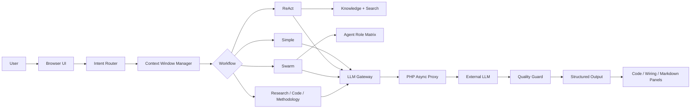

# GH Helper（小壁蜂 OsmiaAI）

**Version**: 0.3.8-beta
**Release date**: 2026-04-27
**Live demo**: https://topogenesis.top/intro/ghhelper
**Repository**: https://github.com/yui277/GH-AI-helper

GH Helper（小壁蜂 OsmiaAI）是面向 Grasshopper 参数化设计学习、方案推演和节点化编程辅助的 AI 工具。它的核心价值不是重新训练一个模型，而是在轻量前端工程中把提示词工程、专精知识库、工作流路由、多智能体协作和大模型代理层组合起来，降低通用 AI 在 GH 场景中“问不准、答得虚、组件乱编、Data Tree 解释不清”的问题。

This public repository is a sanitized technical archive for GH Helper (OsmiaAI). It documents the architecture and release boundary of the 0.3.8-beta line without publishing private source files, API keys, databases, runtime caches, or knowledge-base contents.

---

## Public Release Boundary

本仓库只发布可公开的技术文档、架构图、抽象代码骨架和发布记录。`GH_helper_super0.3.8` 的完整工程源码、后端代理实现、知识库 JSON、SQLite 数据库、用户数据、运行时任务缓存、密钥配置和任何 API key 都不应直接发布到 GitHub。

Public content:

- product and architecture documentation
- sanitized flow diagrams
- abstract module descriptions
- non-secret release notes and policies
- minimal code skeletons for architectural reference

Private content:

- full frontend application source
- backend proxy implementation
- knowledge-base JSON files
- runtime task files and databases
- user data, logs, tokens, keys, and secrets

See [RELEASE-POLICY.md](./RELEASE-POLICY.md) and [SECURITY.md](./SECURITY.md).

---

## Product Positioning

从项目介绍和最新版工程实现看，GH Helper 的定位可以概括为：

- **不是模型训练项目**: 不训练或发布独立大模型，而是调用底层 LLM 能力。
- **不是普通聊天壳**: 前端运行时会根据问题复杂度选择工作流，并组织知识库、搜索、上下文、智能体和结构化输出。
- **面向 GH 的专门化辅助**: 重点处理组件命名、数据树、插件生态、建造理化、代码嵌入、节点连线等 GH 特有问题。
- **轻量部署**: 以浏览器端模块化运行时 + PHP 代理 + SQLite/文件任务队列为主，避免把 API key 暴露给前端。
- **可随底层模型成长**: 工具层把专业交互、知识组织和质量约束做好，底层模型升级时可以获得更好的输出质量。

---

## Technical Highlights

- **Intent Router**: 使用 LLM 分析复杂度、工作流类型、是否需要搜索、知识库、代码生成和深度分析；解析失败时有规则降级路由。
- **Six Workflow Types**: `simple_answer`、`react_tool_loop`、`multi_agent_swarm`、`research_synthesis`、`code_generation`、`deep_methodology_review`。
- **Agent Role Matrix**: 覆盖 lead、methodology、plugin、script、node、datatree、fabrication、research、kb_recall、critic、synthesizer 等角色。
- **Context Runtime**: 保留系统 primer 与近期消息，在上下文压力接近预算阈值时压缩中段内容。
- **Memory and Artifacts**: 会话内维护短期记忆、工作记忆、长期摘要和结构化 artifacts，用于计划、研究笔记、代码和连线方案。
- **Async LLM Proxy**: 默认异步任务模式，浏览器先拿到 `task_id`，再轮询任务状态；API key 只在服务器侧读取。
- **Quality Guard**: 包含循环检测和面向 GH 组件声明的幻觉检查，降低重复动作和未经验证的组件断言。
- **Structured Renderers**: 专门处理代码面板与 GH 连线面板，支持语言规范化、复制下载、SVG 连线图、缩放和平移。

---

## Documentation Map

| File | Purpose |
| --- | --- |
| [TECHNICAL-ARCHITECTURE.md](./TECHNICAL-ARCHITECTURE.md) | 0.3.8-beta 的公开版技术架构说明，包含核心逻辑图 |
| [DATA-FLOW.md](./DATA-FLOW.md) | 用户请求、异步代理、上下文压缩、结构化渲染的数据流 |
| [MODULES.md](./MODULES.md) | 去教程化后的模块职责表和技术价值说明 |
| [API-REFERENCE.md](./API-REFERENCE.md) | 脱敏后的 API 行为说明，重点是后端代理和异步任务模式 |
| [Architecture-Whitepaper-CN-EN.md](./Architecture-Whitepaper-CN-EN.md) | 架构白皮书公开版，解释设计动机和演进逻辑 |
| [DEPLOYMENT.md](./DEPLOYMENT.md) | 私有部署形态的脱敏说明 |
| [EXTENSION-GUIDE.md](./EXTENSION-GUIDE.md) | 扩展角色、知识库和工作流时的边界说明 |
| [RELEASE-POLICY.md](./RELEASE-POLICY.md) | 发布边界和脱敏规则 |
| [SECURITY.md](./SECURITY.md) | 安全说明 |

---

## Architecture At A Glance



---

## 0.3.8-beta Summary

- ChatGPT-style sidebar and main conversation layout.
- Think Max, Non-Think Precise, and Non-Think Creative modes.
- History reload now rebuilds wiring and code panels instead of losing structured content.
- Frontend and backend max token settings aligned to 64096.
- Thinking mode parameter handling cleaned up.
- Password hashing moved to `password_hash` / `password_verify`.
- Session tokens moved to random 64-hex tokens stored server-side with expiry.
- Swarm task decomposition moved from fixed tasks to lead-agent generated tasks.
- AgentFactory now maps all 11 roles to explicit specialties.

---

## Repository Structure

```text
GH-AI-helper/
├── README.md
├── TECHNICAL-ARCHITECTURE.md
├── Architecture-Whitepaper-CN-EN.md
├── DATA-FLOW.md
├── MODULES.md
├── API-REFERENCE.md
├── DEPLOYMENT.md
├── EXTENSION-GUIDE.md
├── RELEASE-POLICY.md
├── SECURITY.md
└── src/
    ├── core/
    └── agents/
```

The `src/` directory is an abstract reference skeleton only. It is not the private production source tree.

---

## Version History

- `0.3.8-beta`: current sanitized public release line.
- `0.3.6-beta`: archived historical public release.
- Older branch states are preserved under archive branches for traceability.
