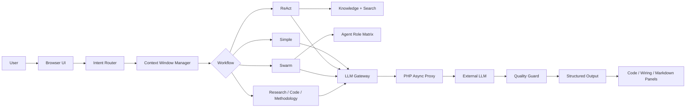

# GH Helper（小壁蜂 OsmiaAI）: 基于动态多维路由的参数化协同矩阵
# GH Helper (OsmiaAI): Parametric Collaborative Matrix Based on Dynamic Multi-dimensional Routing

| Item | Value |
| --- | --- |
| 最新版本 / Version | 0.3.8-beta |
| 更新日期 / Release Date | 2026-04-27 |
| 开发者 / Developer | cf (lichengfu2003) |
| 在线体验 / Live Demo | https://topogenesis.top/intro/ghhelper |
| GitHub Repository | https://github.com/yui277/GH-AI-helper |
| License | MIT, for this public sanitized repository |

---

## 项目简介 / Project Overview

### 中文

传统的单体大模型在面对高度结构化、严谨度极高的 Grasshopper (GH) 节点化编程时，往往会陷入“捏造运算器（幻觉）”“数据拓扑（Data Tree）塌陷”和“回答看似流畅但无法落地”的问题。

**GH Helper（小壁蜂 OsmiaAI）** 并不是一个简单的聊天套壳，也不是重新训练一个独立大模型。它更接近一个面向 GH 场景的轻量 AI 编排层，或可理解为公开文档层面描述的 **Native Multi-Agent Inference Compiler / 原生多代理推理编译引擎**：在浏览器端组织提示词工程、专精知识库、工作流路由、多智能体协作、上下文压缩和结构化渲染，再通过后端代理调用底层 LLM 能力。

它服务的核心对象是参数化设计学习者、Grasshopper 使用者和需要快速推演节点逻辑、脚本逻辑、插件方案、Data Tree 结构与建造理化策略的设计者。

### English

GH Helper (OsmiaAI) is a Grasshopper-focused AI assistant for parametric design learning, workflow reasoning and node-based programming support. It is not a model-training project and not a simple chat wrapper. Its value is in the orchestration layer: prompt-level routing, specialized knowledge retrieval, workflow selection, multi-agent review, context management and structured output rendering.

---

## 发布边界 / Public Release Boundary

本仓库是公开发布仓库，只包含脱敏后的技术文档、架构说明、逻辑图和抽象化代码骨架。`GH_helper_super0.3.8` 的完整工程源码、后端代理实现、知识库 JSON、SQLite 数据库、用户数据、运行时任务缓存、密钥配置和任何 API key 都不应直接发布到 GitHub。

This repository is a sanitized public archive. It does not contain the full private production source tree, backend proxy source, knowledge-base JSON, runtime databases, user data, task cache or secrets.

可以公开 / Public:

- 技术架构文档、模块说明、数据流图和发布记录
- 脱敏后的 API 行为说明
- 抽象代码骨架和设计说明
- 不含真实凭据的配置示例

不应公开 / Private:

- 完整前端和后端生产源码
- 私有知识库 JSON
- 数据库、任务缓存、日志和用户数据
- API key、GitHub token、cookie、密码和私钥

发布规则见 [RELEASE-POLICY.md](./RELEASE-POLICY.md)，安全说明见 [SECURITY.md](./SECURITY.md)。

---

## 核心架构特性 / Core Architecture Features

### 1. 动态意图路由 / Dynamic Intent Routing

系统会先判断用户问题属于简单解释、检索增强、代码生成、多智能体协作、研究综合还是深度方法论审查，而不是把所有问题都直接塞进同一个长 Prompt。

The router classifies the request before execution, selecting a workflow instead of forwarding raw chat history directly to the model.

### 2. 专业视角矩阵 / Specialist Perspective Matrix

公开可描述的专业角色包括：

- **Methodology / 方法架构**: 统筹生成逻辑、算法策略和设计方法。
- **Plugin / 算法生态**: 评估第三方插件调用、依赖风险和原生替代路径。
- **Script / 语法编程**: 约束 C#/Python 脚本植入、Type Hint 和 GH 脚本环境。
- **Node / 组件推演**: 校验 GH 原生组件名称、面板位置和连线拓扑。
- **DataTree / 数据拓扑**: 关注 Graft、Flatten、Simplify、列表层级与树结构。
- **Fabrication / 建造理化**: 审查几何降阶、有理化、公差和加工可行性。
- **Research / 联网检索**: 在需要时补充外部资料和案例背景。
- **Critic / 审查**: 对结果进行风险、幻觉和可执行性检查。
- **Synthesizer / 综合**: 将多视角输出合成为最终回答。

### 3. JIT Prompt 编排 / JIT Prompt Orchestration

当用户激活多种专业意图时，系统会把角色、约束、输出格式和上下文材料即时组装成当前请求专属的系统指令。

```text
场景构建 -> 专业视角注入 -> 约束声明 -> 输出格式钳制
Scene construction -> Specialist injection -> Constraint declaration -> Output format control
```

### 4. 上下文、记忆与 Artifacts / Context, Memory and Artifacts

0.3.8-beta 引入了更明确的运行时层：保留稳定 primer 和近期消息，在上下文压力较高时压缩中段历史，并把计划、研究笔记、代码和连线结果保存为结构化 artifacts。

### 5. 异步 LLM 代理 / Async LLM Proxy

浏览器不直接携带 provider API key。默认请求由服务器生成任务 ID，前端轮询任务状态，后端负责参数校验、密钥读取、模型请求和任务结果写入。

### 6. 结构化渲染 / Structured Rendering

GH 问题往往不适合只用长文本回答。系统会将部分输出渲染为代码面板、连线面板或 Markdown 文档面板，使用户能直接检查脚本、节点拓扑和方案步骤。

---

## 技术栈 / Tech Stack

### 前端 / Frontend

- **核心语言 / Core language**: JavaScript (ES6+)
- **界面形态 / UI**: ChatGPT-style sidebar + main conversation workspace
- **渲染能力 / Rendering**: Markdown, code panel, SVG-style wiring panel
- **架构模式 / Architecture pattern**: event-driven runtime, state machine, workflow factory, agent orchestration

### 后端 / Backend

- **服务器语言 / Server language**: PHP 7.4+
- **数据库 / Database**: SQLite with WAL-style deployment settings
- **API 架构 / API architecture**: REST-style private proxy + async task polling
- **安全 / Security**: server-side secrets, bcrypt-style password verification, random server-stored tokens

### AI / AI Layer

- **主模型 / Main model**: deployment-selected LLM, currently documented around DeepSeek V4 Pro behavior
- **Prompt 工程 / Prompt engineering**: JIT instruction assembly + role matrix + quality guard
- **Think 模式 / Think modes**: Think Max, Non-Think Precise, Non-Think Creative

---

## 架构总览 / Architecture At A Glance



---

## 0.3.8-beta 更新内容 / 0.3.8-beta Changelog

### UI 重构 / UI Redesign

- ChatGPT-style sidebar + main conversation layout.
- 对话历史、设置、导航整合到侧边栏。
- 历史加载时自动重建 wiring/code panels，减少结构化内容丢失。

### Think 模式 / Think Modes

- **Think Max**: 深度推理模式。
- **Non-Think Precise**: 更低随机性的精确技术回答。
- **Non-Think Creative**: 更适合发散式设计探索。

### 工程修复 / Engineering Fixes

- 前后端 `max_tokens` 对齐到 64096。
- Thinking 模式下清理不兼容参数。
- self-critique JSON 字段兼容性增强。
- SwarmWorkflow 从固定任务改为由 LeadAgent 动态拆解。

### 安全加固 / Security Hardening

- 密码验证迁移到现代 password hashing API。
- Token 改为服务器生成、服务器存储、带过期时间的随机 64 位十六进制值。
- API 参数服务端校验和裁剪。

---

## 公开仓库结构 / Public Repository Structure

```text
GH-AI-helper/
├── README.md
├── LICENSE
├── TECHNICAL-ARCHITECTURE.md
├── Architecture-Whitepaper-CN-EN.md
├── DATA-FLOW.md
├── MODULES.md
├── API-REFERENCE.md
├── DEPLOYMENT.md
├── EXTENSION-GUIDE.md
├── RELEASE-POLICY.md
├── SECURITY.md
└── src/
    ├── core/
    └── agents/
```

`src/` 目录只保留抽象代码骨架，用于技术说明和架构参考，不是私有生产源码。

---

## 快速开始 / Quick Start

### 在线体验 / Live Demo

访问：https://topogenesis.top/intro/ghhelper

### 阅读本公开仓库 / Read This Public Repository

1. 先读 [TECHNICAL-ARCHITECTURE.md](./TECHNICAL-ARCHITECTURE.md) 了解 0.3.8-beta 架构。
2. 再读 [DATA-FLOW.md](./DATA-FLOW.md) 查看请求、异步代理、上下文压缩和结构化渲染。
3. 如需了解模块职责，读 [MODULES.md](./MODULES.md)。
4. 如需了解发布边界，读 [RELEASE-POLICY.md](./RELEASE-POLICY.md) 和 [SECURITY.md](./SECURITY.md)。

### 私有部署说明 / Private Deployment Note

公开 GitHub 仓库不包含可直接部署的完整工程文件。私有部署需要独立的前端工程、PHP 代理、SQLite 数据库、运行时目录、知识库文件和服务端密钥配置；这些内容不应直接进入公开仓库。

---

## 架构核心指标 / Core Architecture Metrics

| 指标 / Metric | 0.3.8-beta | 说明 / Description |
| --- | --- | --- |
| 智能体角色 / Agent roles | 11 | lead, specialist, critic, synthesizer 等 |
| 工作流类型 / Workflow types | 6 | Simple, ReAct, Swarm, Research, Code, Methodology |
| Think 模式 / Think modes | 3 | Think Max, Precise, Creative |
| API key 暴露面 / API key exposure | 0 browser-side | 前端不保存 provider key |
| Chat 请求形态 / Chat request mode | async by default | task_id + polling |
| 结构化输出 / Structured outputs | code + wiring + markdown | 更适配 GH 方案检查 |
| 知识库发布策略 / KB release strategy | private | 只公开类别和检索逻辑，不公开 JSON 内容 |

---

## 更多文档 / More Documentation

- **技术架构 / Technical Architecture**: [TECHNICAL-ARCHITECTURE.md](./TECHNICAL-ARCHITECTURE.md)
- **架构白皮书 / Architecture Whitepaper**: [Architecture-Whitepaper-CN-EN.md](./Architecture-Whitepaper-CN-EN.md)
- **API 参考 / API Reference**: [API-REFERENCE.md](./API-REFERENCE.md)
- **模块说明 / Module Architecture**: [MODULES.md](./MODULES.md)
- **数据流图 / Data Flow**: [DATA-FLOW.md](./DATA-FLOW.md)
- **部署说明 / Deployment Notes**: [DEPLOYMENT.md](./DEPLOYMENT.md)
- **扩展指南 / Extension Guide**: [EXTENSION-GUIDE.md](./EXTENSION-GUIDE.md)
- **发布边界 / Release Policy**: [RELEASE-POLICY.md](./RELEASE-POLICY.md)
- **安全说明 / Security**: [SECURITY.md](./SECURITY.md)

---

## 版本历史 / Version History

- `0.3.8-beta`: 当前公开脱敏技术文档版本。
- `0.3.6-beta`: 历史公开文档版本。
- 更早的公开仓库状态通过 archive branches 和 tags 保留可追溯性。

---

## 开源协议 / License

本公开仓库中的脱敏技术文档、架构图和抽象代码骨架采用 **MIT License** 发布，详见 [LICENSE](./LICENSE)。

The sanitized technical documentation, diagrams and abstract code skeletons in this public repository are released under the **MIT License**. See [LICENSE](./LICENSE).

注意：MIT License 仅适用于本公开仓库中实际发布的内容，不代表未发布的私有工程源码、私有知识库、数据库、运行数据、商用部署配置或密钥资产也被开放授权。

---

**Developed by cf (lichengfu2003) | GH Helper / OsmiaAI 0.3.8-beta**
