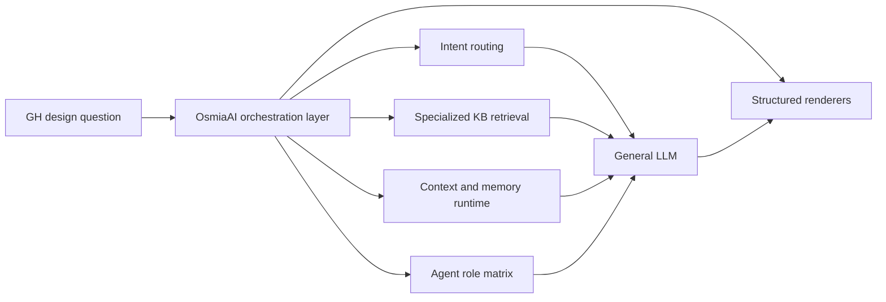
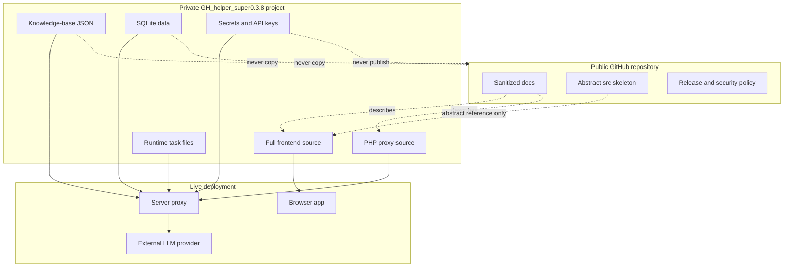
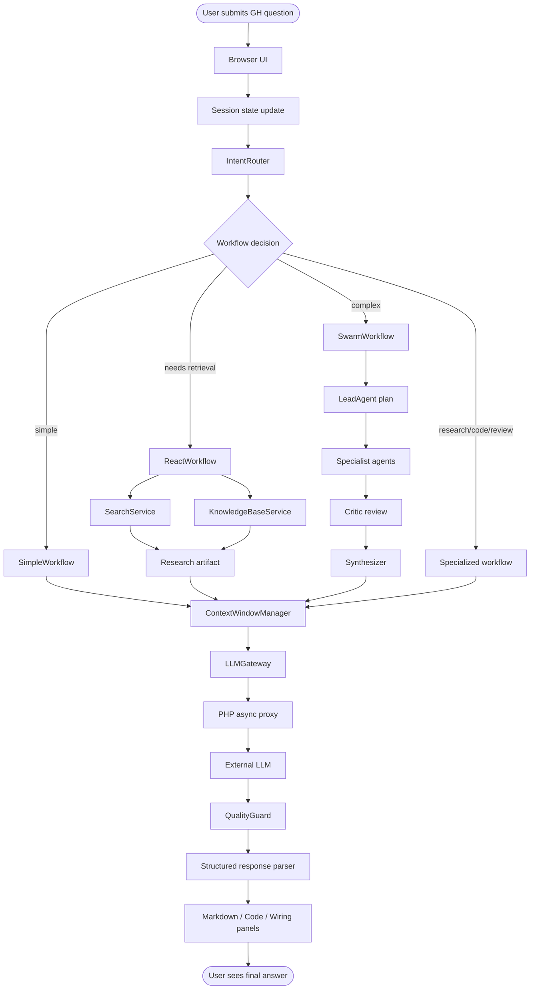
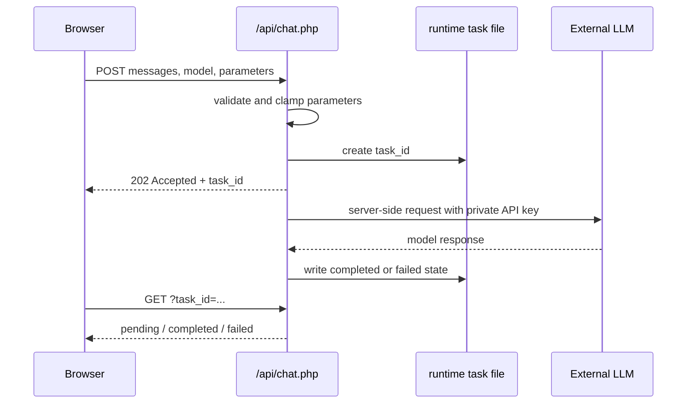
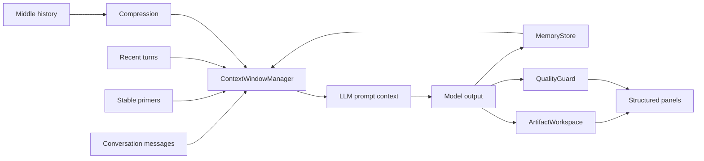

# Technical Architecture

**Project**: GH Helper（小壁蜂 OsmiaAI）
**Version**: 0.3.8-beta
**Document status**: public sanitized architecture notes

This document is based on the 0.3.8-beta project line and the public product positioning of OsmiaAI. It intentionally excludes private source files, API keys, knowledge-base contents, runtime task files, databases and user data.

---

## 1. Product Logic

GH Helper is best understood as a GH-specialized orchestration layer around a general LLM. Its value is not in training a new model. Its value is in the product and runtime layer:

- understand whether a GH question is simple, research-heavy, code-heavy or topology-heavy
- retrieve targeted GH knowledge when useful
- keep useful context while compressing long conversations
- ask specialist agents to inspect methodology, plugins, scripts, nodes, Data Tree and fabrication risk
- render final output as text, code or wiring artifacts instead of only plain chat
- keep API keys and runtime state on the server side

---

## 2. Public And Private Boundary

The public repository is not a deployment package. It is a technical archive and release boundary.

---

## 3. Runtime Pipeline

Key point: routing happens before the expensive model call. The system attempts to send a prepared context and workflow-specific instruction rather than forwarding raw chat history directly.

---

## 4. Async Chat Proxy

0.3.8-beta uses an asynchronous chat proxy by default.

This protects secrets and avoids exposing provider credentials in browser traffic. The proxy validates task IDs, cleans expired task files and supports a synchronous fallback only when explicitly requested by the private implementation.

---

## 5. Context, Memory And Artifacts

The context manager keeps stable primers and recent turns while compressing older middle content when the token budget is under pressure. This is important for GH tasks because the useful state may be a mix of design goals, plugin choices, node topology and code.

---

## 6. What Is Technically Valuable

| Area | Value |
| --- | --- |
| JIT-style prompt assembly | Active intents become a compact, request-specific instruction matrix |
| Workflow routing | Different execution paths for simple, retrieval, swarm, research, code and review tasks |
| Agent specialization | GH-specific roles reduce generic answers and force topology/code/plugin checks |
| Context compression | Long conversations stay usable without blindly forwarding all history |
| Artifact workspace | Plans, research notes, code and wiring outputs stay structured |
| Async proxy | Keeps browser responsive and API keys server-side |
| Quality guard | Detects repeated loops and risky unverified GH component claims |
| Wiring renderer | Converts graph-like answers into inspectable node/edge diagrams |
| Code panel | Makes generated scripts easier to inspect, copy and download |
| Secure auth changes | Uses bcrypt-style password verification and random server-stored tokens |

---

## 7. Module Responsibility Table

| Private module area | Public architectural role |
| --- | --- |
| core runtime | State machine, runtime states, workflow constants, role constants |
| services | LLM proxy client, KB retrieval, search fallback, summarization |
| workflows | Router, workflow engine, simple/ReAct/swarm and specialized flows |
| agents | Lead planning, specialist execution, critique and synthesis |
| runtime | Context window, memory, artifact workspace, loop and quality checks |
| code panel | Script display, line numbering, copy/download, language normalization |
| wiring panel | Node/connection normalization, SVG rendering, zoom/pan/export |
| PHP chat proxy | Async tasks, parameter validation, secret loading, provider request |
| PHP app API | Auth tokens, conversation persistence, SQLite settings |

---

## 8. Documentation Boundary

The following should stay out of public docs:

- provider API keys or personal access tokens
- exact private knowledge-base contents
- user data, logs, runtime task JSON and databases
- full production frontend or backend source
- server-specific paths, domains or credentials beyond public demo links
- copied internal prompts that would expose private product logic

The following is safe and useful:

- architecture responsibilities
- release history
- high-level workflow diagrams
- security boundary descriptions
- abstract module behavior
- sanitized API behavior
